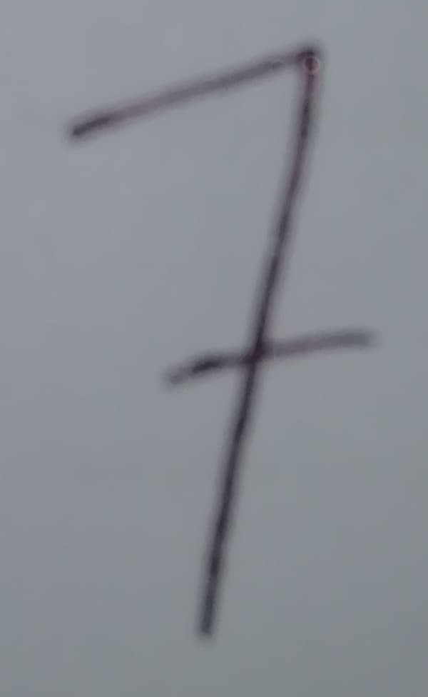

<h1>Handwritten digit classifier using SVM</h1>
 
<h3>Train digit classifier by running 'train_digit_classifier.py' file.</h3>

Model used for classifying is SVC from keras.svm. MNIST handwritten digit dataset is used. It uses black and white images with 28*28 pixels, black digits on white background. LDA is applied for feature selection i.e. to reduce the number of pixels. The model is saved into a pickle file after successful training.

    
<h3>Predict handwritten digit by running 'predict_digit.py' file.</h3>

Image processing steps include : 
<ol>
  <li>Calculate variance</li>
  <li>Removing gradient</li>
  <li>Removing conrast</li>
  <li>Resizing the image to fit 28*28 pixels</li>
 </ol>
 Load the model from pickle file and apply the model to predict the processed image.

   
  

